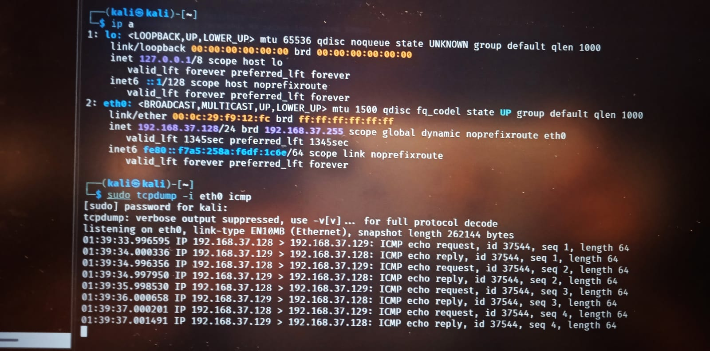
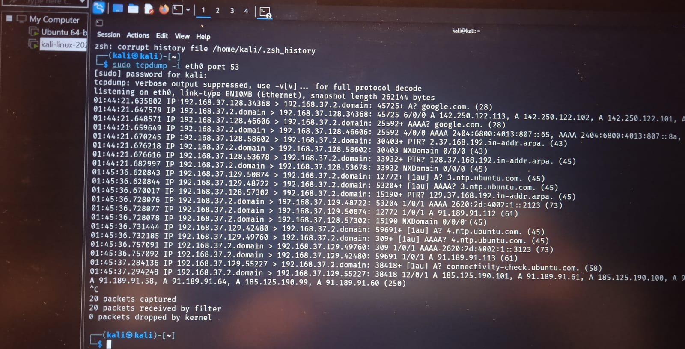
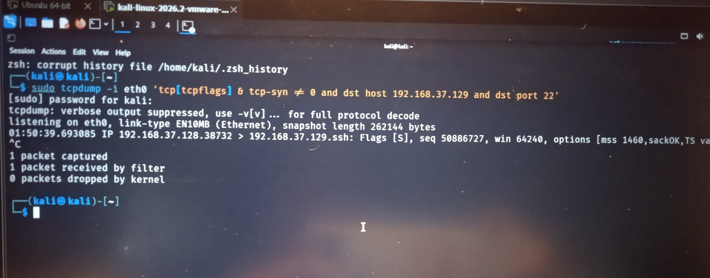
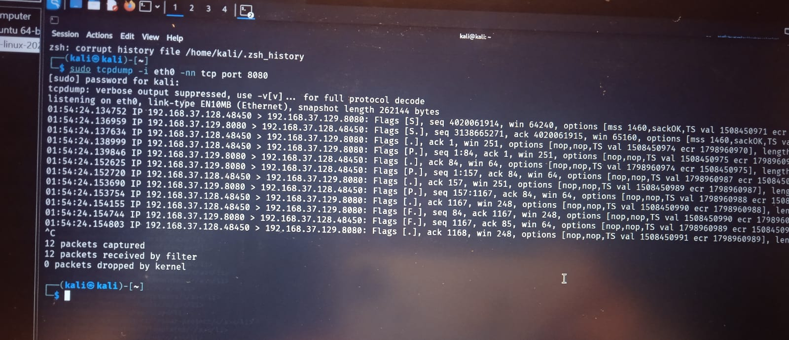

# TCPDump Network Traffic Analysis

## Overview

This project demonstrates basic network traffic capture and analysis using **tcpdump** in a controlled lab environment.

The objective is to understand network communication and identify common traffic patterns from a SOC analyst perspective.

## Tools Used

* Kali Linux
* tcpdump
* Netcat
* nslookup
* Python HTTP Server

## Lab Activities

### 1. ICMP Traffic Capture

Captured ICMP Echo Request and Echo Reply traffic between Kali Linux and Ubuntu.

**Evidence:** `01-icmp-capture.jpeg`

### 2. DNS Traffic Analysis

Captured DNS queries and responses generated while resolving `google.com`.

**Evidence:** `02-dns-analysis.jpeg`

### 3. TCP SYN Analysis

Captured TCP SYN traffic during an SSH connection attempt from Kali to Ubuntu.

**Evidence:** `03-tcp-syn-analysis.jpeg`

### 4. HTTP Traffic Capture

Captured HTTP traffic between Kali and an Ubuntu Python HTTP server running on port 8080.

**Evidence:** `04-http-traffic.jpeg`

## Key Observations

* Identified source and destination IP addresses.
* Observed ICMP request and response communication.
* Analyzed DNS A and AAAA queries.
* Identified TCP SYN packets used to initiate connections.
* Observed TCP and HTTP communication on port 8080.
* Practiced basic packet-level investigation using tcpdump.

## Evidence

### ICMP Capture

### DNS Analysis

### TCP SYN Analysis

### HTTP Traffic

## Conclusion

This project provided hands-on experience with **tcpdump-based network traffic analysis**, including ICMP, DNS, TCP, and HTTP traffic.

The activity demonstrates basic packet analysis skills useful for **SOC monitoring, network troubleshooting, and initial security investigation**.
